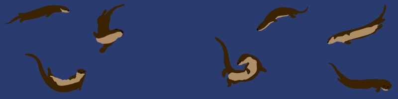

# Naki De Sousa Neves 🦦

🏊 Focusing on 42 Porto projects\
🦾 Interested in buiding embedded software to be used for 3D prosthetics\
🧠 Love learning about mental health and neurodiversity\
📳 Connect with me on [LinkedIn](https://www.linkedin.com/in/nakidesousaneves/)

### ♉🇵🇹🇿🇦🎮🃏🪄🧶🪡🎭🎨🎧🎸🧬🦦🐕🐾🌃⛰️🧗🌈🌊❄️

## Projects

| Project | Description | Technology |
| ------- | ----------- | ---------- |
| [A-Maze-ing](https://github.com/naki7/42-CommonCore/tree/d1c0ab5941f09de4fee681216e564da21edb6fb4/Milestone%202/A-Maze-ing) | Maze generator using Wilson's algorithm to create paths | Python, MLX, Virtual Environments, Linux  |
